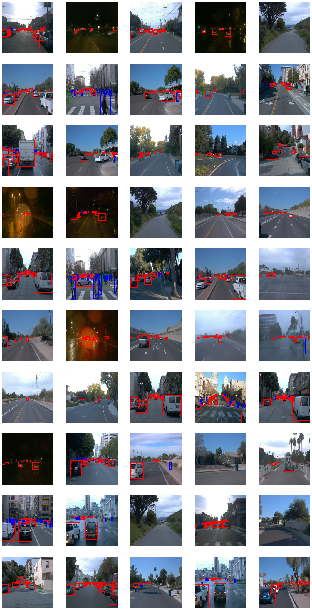
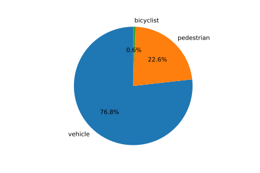
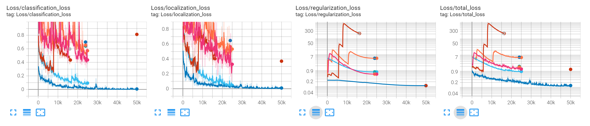
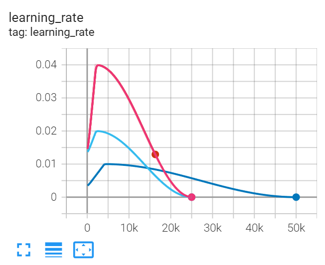

### Project overview
Object detection is an essential part of self-driving car systems, as it is one of the main mechanisms for the car
to be aware of its environment. This includes detecting traffic signs and lights, other vehicles, pedestrians and
cyclists as well as unforeseen road conditions such as traffic cones at construction sites.

In this project, I have trained a [Single Shot MultiBox Detector](https://arxiv.org/abs/1512.02325) object detection
model on a subset of the [Waymo Open Dataset](https://www.waymo.com/open) to detect three common classes of objects
using a vehicle's front facing camera: vehicles, cyclists and pedestrians.

### Set up
This project uses the dependencies as provided in the starter code, i.e. you can use the Dockerfile at
`build/Dockerfile` to run the project.

### Dataset
#### Dataset analysis
The exploratory data analysis was performed in the notebook `Exploratory Data Analysis.ipynb`, and yielded the following
findings:

- Images have a fixed square size of 640x640. The image contents look slightly squished, so they may have originally 
  been taken in a 4:3 or 16:9 aspect ratio.
- Objects are labeled with three classes: vehicle (1), pedestrian (2) and cyclist (4)
- One `.tfrecord` file seems to contain a single continuous recording, i.e. images from a single file show very similar
  road conditions
- Between different recordings, the conditions vary a lot:
  - There are both day- and nighttime recordings (though daytime seems to be more common)
  - Weather includes challenging conditions such as rain (with drops on the camera lens) and fog
  - Data includes different kinds of roads: city streets, highways, narrow driveways, etc.
  - Images seem to be taken by a forward-facing camera
- Labels are also included when the objects are very small (far away) or partially occluded
- Vehicles are by far the most common class (76%), cyclists are pretty rare (<1%) - see Figure 2
- While most frames contain one or more objects, the dataset also includes some negative examples
  (i.e., images with no labels at all) 

\
*Figure 1: Examples of images in the dataset*

\
*Figure 2: Class distribution (calculated from a subset of each file due to the large dataset size)*

#### Cross validation
The dataset is split into training, validation and test sets with a 60/20/20 split using the `create_splits.py` scripts.
As mentioned above, each file contains a continuous recording. Therefore, splitting is done inbetween files to make sure
that the model generalizes to unseen recordings with different road conditions.

### Training
#### Reference experiment
The reference experiment was run with the configuration provided in the starter project, except that the batch size
was reduced to 2 as instructed in the README file. The model performance is very poor with average precision close to
zero. Evaluating the model on one of the recordings from the test dataset also confirmed this, as almost no objects
were detected.

Still, it is apparent that the model performs better on larger objects than on smaller ones, which is expected,
especially for single-step object detection models.

```
 Average Precision  (AP) @[ IoU=0.50:0.95 | area=   all | maxDets=100 ] = 0.004
 Average Precision  (AP) @[ IoU=0.50      | area=   all | maxDets=100 ] = 0.010
 Average Precision  (AP) @[ IoU=0.75      | area=   all | maxDets=100 ] = 0.001
 Average Precision  (AP) @[ IoU=0.50:0.95 | area= small | maxDets=100 ] = 0.001
 Average Precision  (AP) @[ IoU=0.50:0.95 | area=medium | maxDets=100 ] = 0.004
 Average Precision  (AP) @[ IoU=0.50:0.95 | area= large | maxDets=100 ] = 0.091
 Average Recall     (AR) @[ IoU=0.50:0.95 | area=   all | maxDets=  1 ] = 0.003
 Average Recall     (AR) @[ IoU=0.50:0.95 | area=   all | maxDets= 10 ] = 0.012
 Average Recall     (AR) @[ IoU=0.50:0.95 | area=   all | maxDets=100 ] = 0.029
 Average Recall     (AR) @[ IoU=0.50:0.95 | area= small | maxDets=100 ] = 0.004
 Average Recall     (AR) @[ IoU=0.50:0.95 | area=medium | maxDets=100 ] = 0.071
 Average Recall     (AR) @[ IoU=0.50:0.95 | area= large | maxDets=100 ] = 0.368
 ```

#### Improve on the reference
Below I inserted plots of losses and learning rates in all the experiments, taken from TensorBoard.
The sections below explain what has been changed in each experiment.

As the provided code for evaluation is a separate script that runs only once, the validation losses are only shown
for the final state of the training as opposed to a continuous curve for each iteration.

\
*Figure 3: Loss curves of all training runs. orange: reference, pink: Experiment 1, brown: Experiment 2,
light blue: Experiment 3, dark blue: Experiment 4.*

\
*Figure 4: Learning rate curves of all training runs. orange: reference, pink: Experiment 1, brown: Experiment 2,
light blue: Experiment 3, dark blue: Experiment 4.*

##### 1. add data augmentations
First, I added some data augmentation strategies to the configuration that are reasonable for the dataset.
The first five additional augmentations simulate changes in the lighting conditions or camera settings:
- Random RGB to Grayscale conversion
- Random brightness adjustment
- Random contrast adjustment
- Random hue adjustment
- Random saturation adjustment

And the final augmentation simulates partial occlusion of the image:
- Randomly replace patches of the image with Gaussian noise

All the augmentations were added with their respective default settings.

```
 Average Precision  (AP) @[ IoU=0.50:0.95 | area=   all | maxDets=100 ] = 0.005
 Average Precision  (AP) @[ IoU=0.50      | area=   all | maxDets=100 ] = 0.011
 Average Precision  (AP) @[ IoU=0.75      | area=   all | maxDets=100 ] = 0.004
 Average Precision  (AP) @[ IoU=0.50:0.95 | area= small | maxDets=100 ] = 0.000
 Average Precision  (AP) @[ IoU=0.50:0.95 | area=medium | maxDets=100 ] = 0.007
 Average Precision  (AP) @[ IoU=0.50:0.95 | area= large | maxDets=100 ] = 0.057
 Average Recall     (AR) @[ IoU=0.50:0.95 | area=   all | maxDets=  1 ] = 0.006
 Average Recall     (AR) @[ IoU=0.50:0.95 | area=   all | maxDets= 10 ] = 0.014
 Average Recall     (AR) @[ IoU=0.50:0.95 | area=   all | maxDets=100 ] = 0.034
 Average Recall     (AR) @[ IoU=0.50:0.95 | area= small | maxDets=100 ] = 0.009
 Average Recall     (AR) @[ IoU=0.50:0.95 | area=medium | maxDets=100 ] = 0.064
 Average Recall     (AR) @[ IoU=0.50:0.95 | area= large | maxDets=100 ] = 0.467
 ```

The training results improved slightly, but the training loss was still significantly above 1. The jumps in the
training loss curve are a sign of too high learning rates and/or too little regularization, such as too small batch
sizes.

##### 2. increase batch size to 4

In this run, I increased the batch size from 2 to 4, which is the maximum that fits into my 8 GB GPU memory.
The training loss curves initially showed significantly better values, but later started to jump again, so I cancelled
the training run before completion.

##### 3. decrease learning rate to 0.02

In this experiment, the base learning rate was decreased from 0.04 to 0.02. This got rid of the jumps in the loss curve
and significantly improved the accuracy.

```
 Average Precision  (AP) @[ IoU=0.50:0.95 | area=   all | maxDets=100 ] = 0.067
 Average Precision  (AP) @[ IoU=0.50      | area=   all | maxDets=100 ] = 0.149
 Average Precision  (AP) @[ IoU=0.75      | area=   all | maxDets=100 ] = 0.053
 Average Precision  (AP) @[ IoU=0.50:0.95 | area= small | maxDets=100 ] = 0.017
 Average Precision  (AP) @[ IoU=0.50:0.95 | area=medium | maxDets=100 ] = 0.173
 Average Precision  (AP) @[ IoU=0.50:0.95 | area= large | maxDets=100 ] = 0.522
 Average Recall     (AR) @[ IoU=0.50:0.95 | area=   all | maxDets=  1 ] = 0.019
 Average Recall     (AR) @[ IoU=0.50:0.95 | area=   all | maxDets= 10 ] = 0.073
 Average Recall     (AR) @[ IoU=0.50:0.95 | area=   all | maxDets=100 ] = 0.113
 Average Recall     (AR) @[ IoU=0.50:0.95 | area= small | maxDets=100 ] = 0.058
 Average Recall     (AR) @[ IoU=0.50:0.95 | area=medium | maxDets=100 ] = 0.242
 Average Recall     (AR) @[ IoU=0.50:0.95 | area= large | maxDets=100 ] = 0.591
 ```

##### 4. decrease learning rate to 0.01

This experiment further decreases the base learning rate to 0.01, and also decreases the warmup learning rate
accordingly. I also left the training run for more iterations (50000 instead of 25000). This further increases the
model accuracy, with average precision and recall over 0.7 for large objects.

```angular2html
 Average Precision  (AP) @[ IoU=0.50:0.95 | area=   all | maxDets=100 ] = 0.130
 Average Precision  (AP) @[ IoU=0.50      | area=   all | maxDets=100 ] = 0.251
 Average Precision  (AP) @[ IoU=0.75      | area=   all | maxDets=100 ] = 0.111
 Average Precision  (AP) @[ IoU=0.50:0.95 | area= small | maxDets=100 ] = 0.040
 Average Precision  (AP) @[ IoU=0.50:0.95 | area=medium | maxDets=100 ] = 0.345
 Average Precision  (AP) @[ IoU=0.50:0.95 | area= large | maxDets=100 ] = 0.737
 Average Recall     (AR) @[ IoU=0.50:0.95 | area=   all | maxDets=  1 ] = 0.027
 Average Recall     (AR) @[ IoU=0.50:0.95 | area=   all | maxDets= 10 ] = 0.132
 Average Recall     (AR) @[ IoU=0.50:0.95 | area=   all | maxDets=100 ] = 0.179
 Average Recall     (AR) @[ IoU=0.50:0.95 | area= small | maxDets=100 ] = 0.082
 Average Recall     (AR) @[ IoU=0.50:0.95 | area=medium | maxDets=100 ] = 0.423
 Average Recall     (AR) @[ IoU=0.50:0.95 | area= large | maxDets=100 ] = 0.784
```

A video of the model from the final experiment, evaluated on one of the recordings from the test set, is shown here:
